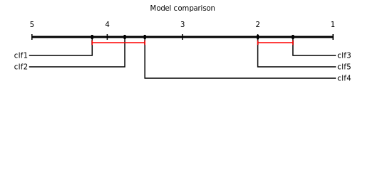

# cddiagram

A pure Python library for generating Critical Difference (CD) diagrams as SVG.

CD diagrams visualize the statistical comparison of multiple classifiers (or models) over multiple datasets, as introduced by Demsar (2006). They show the average rank of each model and connect groups of models whose performance differences are **not** statistically significant.

> J. Demsar, "Statistical Comparisons of Classifiers over Multiple Data Sets",
> *Journal of Machine Learning Research*, vol. 7, pp. 1-30, 2006.
> https://jmlr.org/papers/v7/demsar06a.html

## How it works

1. A **Friedman test** checks whether at least one model differs significantly from the others (at alpha = 0.05).
2. If significant, the **Nemenyi post-hoc test** computes a critical distance (CD) threshold.
3. Models whose average rank difference is less than CD are grouped together — they are not statistically distinguishable.
4. The result is rendered as an SVG diagram showing ranked models and significance groups.

## Install

```bash
pip install cddiagram
```

Requires Python 3.12+ and depends on `numpy` and `scipy`.

## Usage

### Write to file

```python
import numpy as np
from cddiagram import draw_cd_diagram

rng = np.random.default_rng(1)

models = {
    "model1": rng.normal(loc=0.2, scale=0.1, size=30),
    "model2": rng.normal(loc=0.2, scale=0.1, size=30),
    "model3": rng.normal(loc=0.4, scale=0.1, size=30),
    "model4": rng.normal(loc=0.5, scale=0.1, size=30),
    "model5": rng.normal(loc=0.7, scale=0.1, size=30),
    "model6": rng.normal(loc=0.7, scale=0.1, size=30),
    "model7": rng.normal(loc=0.8, scale=0.1, size=30),
    "model8": rng.normal(loc=0.9, scale=0.1, size=30),
}

samples = np.column_stack(list(models.values()))
draw_cd_diagram(samples, labels=list(models.keys()), out_file="out.svg", title="Model comparison")
```



### Non-significant results

If the Friedman test is not significant, the function issues a warning and returns `None` — no diagram is produced because the data does not support ranking the models.

## API

```python
draw_cd_diagram(
    samples,           # 2D array-like (rows=datasets, columns=models)
    labels,            # Sequence of model names (one per column)
    title=None,        # Optional diagram title
    out_file=None,     # Optional path to write SVG file
    fig_size=None,     # Optional (width, height) tuple in pixels
) -> Element | None
```

**Input formats**: NumPy arrays, pandas DataFrames, or any object with a `.to_numpy()` / `.values` attribute.

## Release Notes

### 0.0.2

- Replaced hardcoded Nemenyi critical-value lookup table with SciPy's `studentized_range` computation.
- Updated CD diagram drawing to follow continuous rank-axis placement and first-anchor non-significant grouping.
- Improved readability for larger numbers of algorithms with adaptive multi-row label layout.

## License

MIT
